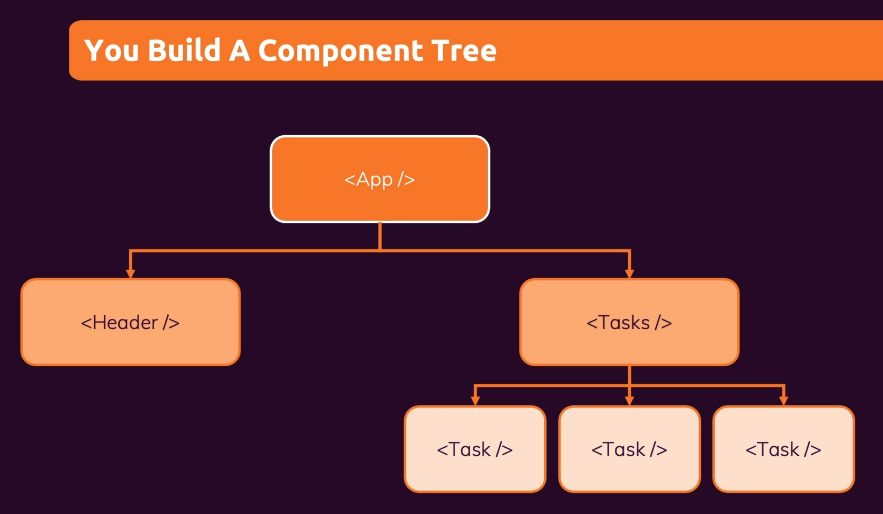
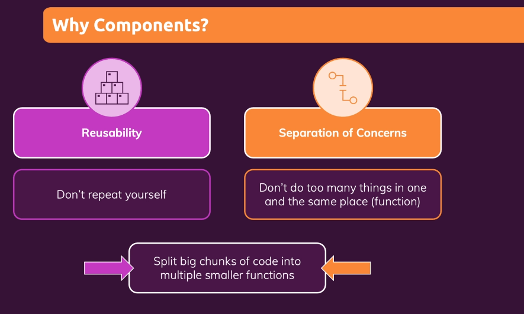

# What are we covering today?

	1. Class Components
	2. Functional Components
	3. Life Cycle of Component
	4. Nesting Components
	5. Stateless and Stateful Components
    6. Component communication between Parent to Child & vice versa
	7. Styling React Components

### React Components
 

### Buidling First Custom Component
 

### Why Components?

One of the most important aspects of React is the fact that you can create components, which are like custom, reusable HTML elements, to quickly and efficiently build user interfaces.

 

	1. Resuability
	2. Sepration of Concerns
	3. Don't repeat youself
	4. Don't do too many things in one and the same place (function)

 Assignement:

  

 --------------------------------------------------------------------------------------

Almost everything in React consists of components, which can be 

	1. Class components
	2. Simple components

Before React 16.8, Class components were the only way to track state and lifecycle on a React component. Function components were considered "state-less".
With the addition of Hooks, Function components are now almost equivalent to Class components. The differences are so minor that you will probably never need to use a Class component in React.

## Life Cycle Events

Each component in React has a lifecycle which you can monitor and manipulate during its three main phases.
The three phases are: Mounting, Updating, and Unmounting.

	1. Mounting (3) - constructor > render > componentDidMount
	2. Update (3) - shouldComponentUpdate > render > componentDidUpdate
	3. Unmounting (1) - componentWillUnmount

Differences between Functional Components and Class Components in React:

Functional Components | Class Components |
--------------------- | ---------------- |
A functional component is just a plain JavaScript pure function that accepts props as an argument and returns a React element(JSX). | A class component requires you to extend from React. Component and create a render function which returns a React element. |
There is no render method used in functional components. | It must have the render() method returning JSX (which is syntactically similar to HTML) |
Functional component run from top to bottom and once the function is returned it can't be kept alive. | Class component is instantiated and different life cycle method is kept alive and being run and invoked depending on phase of class component. |
Also known as Stateless components as they simply accept data and display them in some form, that they are mainly responsible for rendering UI. | Also known as Stateful components because they implement logic and state. |
React lifecycle methods (for example, componentDidMount) cannot be used in functional components. | React lifecycle methods can be used inside class components (for example, componentDidMount). |
Hooks can be easily used in functional components to make them Stateful. | It requires different syntax inside a class component to implement hooks. |
Constructors are not used. | Constructor are used as it needs to store state. |